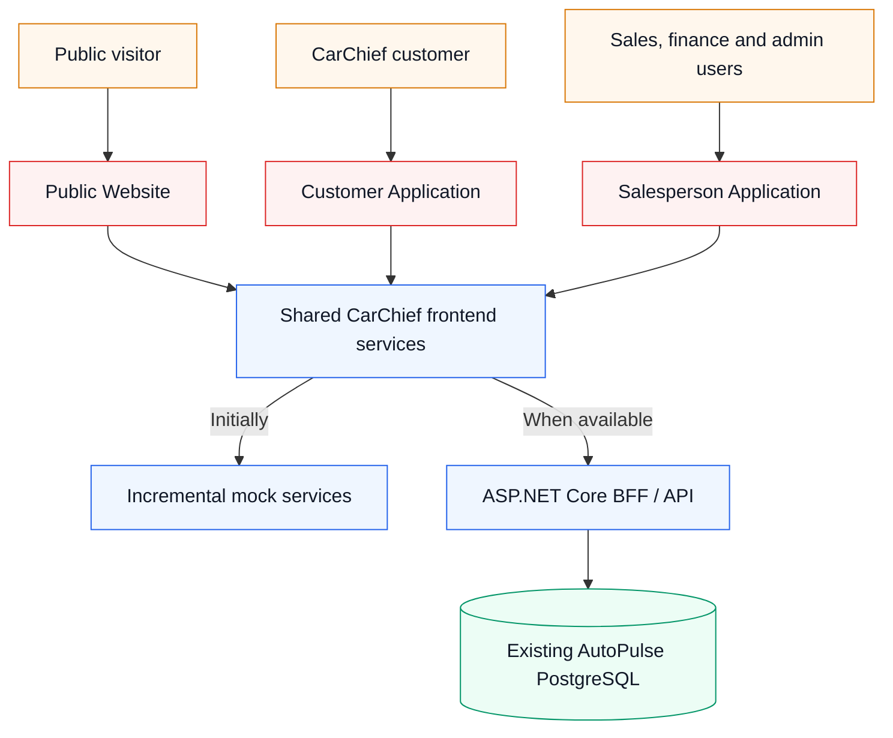
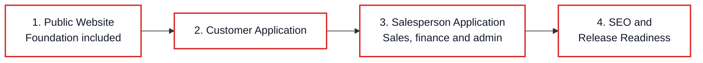
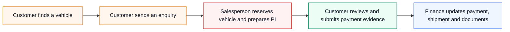
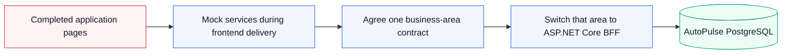

# CarChief Frontend Implementation Roadmap

## Management presentation

**Purpose:** Rebuild the CarChief POC as three production-quality applications delivered one at a time.  
**Delivery order:** Public Website → Customer Application → Salesperson Application → SEO Completion and Release Readiness  
**Base scheduled delivery:** **18.5 calendar weeks**  
**Programme allowance:** **3 weeks** for integration, review corrections, and accepted uncertainty  
**Management planning range:** **21–22 calendar weeks**  
**Detailed plan:** [CarChief Frontend Implementation Plan](./CarChief-Frontend-Implementation-plan.md)

## 1. Executive summary

CarChief has a substantial proof of concept covering public vehicle discovery, customer self-service, and the work performed by sales, finance, and administration teams.

The production rebuild will be delivered application by application:

1. Complete and accept the Public Website.
2. Complete and accept the Customer Application.
3. Complete and accept the Salesperson Application, including its finance and administration modules.
4. Complete full SEO and final release readiness.

Each application is divided into small page- or component-focused phases. Every phase includes the screen, its supporting demonstration data, validation, tests, review, and a visible result. Mock services are extended only when the current page requires them.

The revised **21–22-week** management range is a bottom-up estimate based on the re-audited pages and components. It replaces the earlier 14–16-week estimate, which grouped several large areas into broad milestones and allowed more cross-application parallel delivery.

## 2. What the re-audit confirmed

### Evidence levels

| Evidence | Meaning |
|---|---|
| **Source-confirmed** | Supported by the supplied TypeScript, configuration, utilities, or server source |
| **Compiled-artifact evidence** | Visible in a built HTML demonstration, but original source is missing |
| **Recommendation** | Proposed production approach rather than an existing POC capability |
| **Open question** | Requires a business, security, finance, AutoPulse, legacy, or BFF decision |

### Confirmed application coverage

| Application | Main capabilities found |
|---|---|
| Public Website | Home/showroom, inventory search, vehicle details and media, freight estimate, enquiry, customer login/reservation entry, About, How to Buy, Testimonials, FAQ and Contact |
| Customer Application | Compiled evidence for login, dashboard, showroom, sourced/reserved/invoiced vehicles, PI/invoices, TT payments, shipment tracking, documents, notifications and profile |
| Salesperson Application | Dashboard, global search, inventory/media, imports, leads, customers, reservations, PI/invoices, finance/allocation, exchange rates, masters, tiers, users/roles, branding and FAQ |

Representative source evidence: [`POC/src/App.tsx`](../POC/src/App.tsx), [`POC/src/types.ts`](../POC/src/types.ts), and [`POC/src/components/BackendDashboard.tsx`](../POC/src/components/BackendDashboard.tsx).

### Important limitations

- The available source uses Firebase Authentication and Firestore, not Supabase.
- The production frontend will use neither Firebase nor Supabase directly.
- Customer portal source, customer types/context, Firebase configuration, Firestore cache/instrumentation, and the audit component are missing.
- Detailed Customer Application behavior remains provisional until business owners approve it.
- PayPal, email, WhatsApp, AI, tracking, and download labels do not prove production vendor integration.
- Sensitive credential-like bootstrap behavior exists in the POC source and must be reviewed/rotated where applicable; no values are reproduced here.

### Additional details captured by the new plan

The page-level plan now explicitly includes:

- Customer theme/refresh, recovery, chassis search, notifications and unavailable-document behavior.
- Salesperson global search and configurable dashboard widgets.
- Salesperson bulk-TT entry and approved-payment banners.
- Staff and online reservation queues, expiry countdowns and duration settings.
- Categorized image ordering and public/customer visibility.
- PI-to-commercial-invoice conversion and invoiced/sold registries.
- Finance proof review, payment allocation and exchange-rate history.
- A clear distinction between functional screens and unproven external integrations.

## 3. Target solution

**Plain-language explanation:** The three applications share consistent business definitions and design rules. During frontend delivery they use realistic mock services. Later, the ASP.NET Core BFF replaces those mocks and communicates safely with AutoPulse.

## 4. Delivery order

**Plain-language explanation:** One application is completed and accepted before the next becomes the primary delivery. The shared foundation is created during the Public Website delivery, and full SEO is completed after all three applications work together.

## 5. Delivery 1 — Public Website

**Scheduled calendar:** 4 weeks  
**Phase effort:** 5.5 weeks, reduced to four calendar weeks through safe parallel component work

| Phase | Page/component delivery | Visible result | Phase effort |
|---|---|---|---:|
| 1.1 | Shared foundation and public application shell | Responsive Next.js shell, navigation, shared controls, loading/error states and resettable demo data | 1 week |
| 1.2 | Home and showroom | Hero, promoted content, featured vehicles, vehicle cards and empty/loading states | 0.5 week |
| 1.3 | Inventory and search page | Keyword/natural-language search, approved filters, sorting, results and no-results behavior | 1 week |
| 1.4 | Vehicle details | Stable vehicle page, specifications, categorized media, status, sharing and printing | 1 week |
| 1.5 | Freight estimate and quotation enquiry | Destination selection, freight/city/insurance estimate and quotation enquiry | 0.5 week |
| 1.6 | Enquiry, contact, authentication and reservation entry | Contact/vehicle enquiry, customer access entry and reservation eligibility/conflict feedback | 0.5 week |
| 1.7 | Public information and content | About, How to Buy, Testimonials, FAQ and Contact content | 0.5 week |
| 1.8 | Public Website acceptance | Complete visitor journey, responsive/accessibility review and linked enquiry fixtures | 0.5 week |

### Business outcome

A visitor can understand CarChief, find an appropriate vehicle, inspect it, estimate delivery, and contact or request a temporary hold from the sales team.

### Supervisor demonstration

Open the home page, search for an SUV, apply filters, open its vehicle page, review images/specifications, calculate freight, submit an enquiry, and show a customer reservation limit or conflict.

### Important decisions

- Public vehicle fields and media.
- Approved company, inspection, customs, delivery and logistics claims.
- Freight, insurance and discount examples.
- Reservation duration and eligibility.
- Whether AI search or PayPal-labelled booking is required for launch.

### Acceptance

- Public/private information is correctly separated.
- Search, vehicle URLs, freight examples and forms work on supported devices.
- Critical public accessibility and automated journeys pass.
- Public Website scope is accepted before Customer Application delivery becomes primary.

## 6. Delivery 2 — Customer Application

**Scheduled calendar:** 4 weeks  
**Phase effort:** 6 weeks, reduced to four calendar weeks through safe parallel component work  
**Evidence caution:** Customer TypeScript source is missing; compiled pages require business confirmation.

| Phase | Page/component delivery | Visible result | Phase effort |
|---|---|---|---:|
| 2.1 | Customer shell, session and account access | Login/session/account states, protected navigation, recovery concept and approved theme/refresh behavior | 0.5 week |
| 2.2 | Customer dashboard | Tier/account, vehicle, shipment, invoice/payment, notification and document summaries | 0.5 week |
| 2.3 | Customer showroom and vehicle search | Customer-visible stock, search, tier pricing, vehicle detail and reservation eligibility | 0.5 week |
| 2.4 | My vehicles | Sourced, reserved, reserved-with-PI and invoiced vehicles with search/status detail | 1 week |
| 2.5 | Quotes and invoices | PI/commercial invoice views, totals, paid/outstanding and print/download presentation | 0.5 week |
| 2.6 | Payments and TT remittance | TT journal, submission, proof validation and pending/approved/rejected states | 1 week |
| 2.7 | Shipment tracking and documents | Shipment timeline, status exceptions and authorized document vault | 1 week |
| 2.8 | Notifications and profile | Read/unread controls, linked alerts, contact profile and approved account settings | 0.5 week |
| 2.9 | Customer Application acceptance | Customer isolation, business sign-off and complete self-service demonstration | 0.5 week |

### Business outcome

Customers can understand their vehicles, quotes, invoices, payments, shipment progress, documents and notifications without repeatedly asking staff for updates.

### Supervisor demonstration

Sign in as a customer, search eligible stock, inspect reserved/invoiced vehicles, review the PI and outstanding balance, submit TT evidence, track shipment progress, open an allowed document, read a notification and update contact details.

### Important decisions

- Final customer page inventory from the compiled artifact.
- Identity, recovery and MFA.
- Customer ownership and editable profile fields.
- Credit/tier/dashboard definitions.
- Payment-proof, document and KYC storage/retention.
- Shipment status source and live-tracking requirement.

### Acceptance

- Business owners sign off every compiled-only page.
- Customers cannot access another customer’s data or documents.
- Dashboard/invoice/payment totals reconcile with linked records.
- Customer Application scope is accepted before Salesperson Application delivery becomes primary.

## 7. Delivery 3 — Salesperson Application

**Scheduled calendar:** 8 weeks  
**Phase effort:** 11 weeks, reduced to eight calendar weeks through safe parallel component work

The application retains the business name “Salesperson Application,” but permission-controlled finance and administration modules remain inside it.

| Phase | Page/component delivery | Visible result | Phase effort |
|---|---|---|---:|
| 3.1 | Staff access and dashboard | Role-aware login/navigation, operational KPIs, global search, quick actions and notifications | 0.5 week |
| 3.2 | Inventory management | Search/status views, vehicle CRUD, details, media, visibility, reservation queues and countdowns | 1.5 weeks |
| 3.3 | Vehicle and shipment imports | CSV validation, preflight, row correction, reference matching and controlled commit | 1 week |
| 3.4 | Leads and customer management | Lead assignment/status/notes plus customer search, create, edit, tier and assignment | 1 week |
| 3.5 | Reservations and proforma invoices | Reservation/release/expiry, customer selection, pricing and PI create/preview/print | 1.5 weeks |
| 3.6 | Sales registries and customer visibility | PI conversion, invoiced/sold records, balances, portal visibility and communication intent | 0.5 week |
| 3.7 | Payments and finance | Salesperson TT, proof review, approval/rejection, allocation, exchange rates and reconciliation | 1.5 weeks |
| 3.8 | Operational masters and logistics rates | Countries, ports, costs, shippers, banks, terms, freight and city-delivery rates | 1 week |
| 3.9 | Customer tiers | Credit/payment/reservation limits and elapsed-week discounts | 0.5 week |
| 3.10 | Users, roles and permissions | User directory, role assignment, custom roles and granular permissions | 1 week |
| 3.11 | Branding, FAQ and audit | Safe branding, FAQ administration and conditional audit-event presentation | 0.5 week |
| 3.12 | Salesperson Application acceptance | Complete cross-application sales/finance/admin demonstration and regression | 0.5 week |

### Business outcome

Sales, finance and authorized administration users can manage the complete operational journey from enquiry and stock through reservation, invoice, payment allocation and customer-visible updates.

### Supervisor demonstration

Receive the Public Website enquiry, assign it, create/select the customer, reserve the vehicle, issue a PI, show it in the Customer Application, record and approve TT funds, allocate payment, update the transaction, and show shipment/document/notification changes to the customer.

The demonstration will also show vehicle CSV preflight, a freight/master change, a customer tier, a role permission, FAQ/branding administration, and a conditional audit event.

### Important decisions

- Vehicle field dictionary, statuses and CSV templates.
- Lead/customer assignment and KYC privacy.
- Reservation and PI rules.
- Money precision, exchange rates, payment approval/allocation and sold status.
- Master-data ownership and historical behavior.
- Roles, finance separation and identity administration.
- Email, WhatsApp, AI and other launch integrations.

### Acceptance

- Role and customer-ownership tests pass.
- Inventory/import and sales workflows behave consistently.
- Approved PI and finance examples reconcile.
- External-integration buttons are not presented as completed services unless separately implemented.
- The connected three-application journey is accepted.

## 8. End-to-end customer journey

**Plain-language explanation:** The applications are delivered separately, but their demonstration data remains connected. An enquiry created in the Public Website becomes the customer, reservation, invoice, payment and shipment story used by the later applications.

## 9. Delivery 4 — SEO Completion and Release Readiness

**Scheduled calendar and phase effort:** 2.5 weeks

| Phase | Delivery | Visible result | Estimate |
|---|---|---|---:|
| 4.1 | Public URL and indexation policy | Canonicals, sitemap, robots, legacy redirects, sold-vehicle and filter-indexing policy | 0.5 week |
| 4.2 | Metadata and structured data | Page/social metadata plus approved business, vehicle, breadcrumb, HowTo and FAQ data | 0.5 week |
| 4.3 | Public performance and SEO validation | Responsive public images, server-rendered content, link/index/schema and performance checks | 0.5 week |
| 4.4 | Final release readiness | Cross-app regression, accessibility/security/performance gates, BFF pack, UAT and runbooks | 1 week |

### Business outcome

CarChief receives an intentionally indexable public website and a tested frontend release candidate ready for later BFF connection.

### Supervisor demonstration

Open a legacy PHP link and show its correct destination, preview vehicle social/search metadata, verify customer/staff pages are excluded from indexing, run the complete business journey, and recover from a controlled service failure.

### Acceptance

- Canonical, sitemap, robots, redirects and structured data pass validation.
- Approved public performance/accessibility targets pass or have signed waivers.
- Production cannot enable mock data.
- BFF conformance examples, UAT evidence and operational ownership are accepted.

## 10. Timeline, staffing and estimate comparison

| Calendar window | Primary delivery | Scheduled time |
|---|---|---:|
| Weeks 1–4 | Public Website | 4 weeks |
| Weeks 5–8 | Customer Application | 4 weeks |
| Weeks 9–16 | Salesperson Application | 8 weeks |
| Weeks 17–18.5 | SEO Completion and Release Readiness | 2.5 weeks |
|  | **Base scheduled delivery** | **18.5 weeks** |
| Distributed where required | Rounded 15% programme allowance | **3 weeks** |
|  | **Management planning range** | **21–22 weeks** |

### Why the estimate changed

The earlier 14–16-week estimate assumed broader vertical milestones and more parallel work across applications. The re-audit and new delivery strategy now:

- Completes applications sequentially.
- Includes a confirmation gate for missing customer source.
- Breaks every major page into testable components.
- Includes all finance and administration modules inside the Salesperson Application.
- Reserves explicit time for component-level review, correction, app acceptance, SEO and release readiness.

### Staffing assumption

- One accountable solution architect/senior frontend lead.
- One additional experienced frontend engineer.
- Three to five bounded AI-agent workstreams.
- Part-time product/business, design, QA, security and finance review.
- Business decisions and demo feedback normally available within one business day.

AI agents accelerate bounded implementation and testing. Human reviewers remain responsible for architecture, generated work, calculations, security, privacy, accessibility, QA, UAT and release acceptance.

## 11. Moving from mocks to AutoPulse

**Plain-language explanation:** The page does not need to be rebuilt when its real API becomes available. CarChief agrees and tests one business area at a time, then changes the service behind the page from mock data to the BFF.

Production will never silently use mock services. Deterministic mocks remain available for engineering tests and demonstrations.

## 12. Principal decisions and risks

### Management decisions

1. Confirm or supply the missing customer, Firebase, cache and audit source.
2. Confirm why the source uses Firebase/Firestore rather than the earlier Supabase description.
3. Approve customer pages visible only in compiled output.
4. Select production identity, recovery, MFA, roles and finance separation.
5. Approve statuses and worked pricing, freight, tax, currency and allocation examples.
6. Approve public/customer/staff field and media visibility.
7. Approve document, KYC and payment-proof storage, scanning, privacy and retention.
8. Approve vehicle/CSV field mapping and import policy.
9. Decide launch integrations and fund them separately.
10. Provide final domains, public claims and legacy PHP URLs.
11. Assign content, master-data, finance, security, UAT and release owners.

### Principal risks and controls

| Risk | Control |
|---|---|
| Customer source is missing | Require business sign-off for every compiled-only page before acceptance |
| POC and AutoPulse fields differ | Confirm each business-area contract against AutoPulse before BFF integration |
| Browser security patterns are copied | Use a clean implementation and authoritative BFF authorization |
| Financial rules differ between teams | Approve worked examples and automate them |
| Vehicle/CSV scope expands | Approve the field dictionary and templates early |
| Integration labels are mistaken for working vendors | Maintain a separate approved launch-integration list |
| Documents, KYC or proofs are mishandled | Approve storage, scanning, access, privacy, retention and audit policies |
| AI-agent output exceeds review capacity | Use bounded tasks, mandatory human review and automated gates |
| App-first delivery delays end-to-end discovery | Maintain linked fixtures and run a connected demo at each application acceptance |

## 13. Exclusions

- ASP.NET Core BFF development.
- AutoPulse schema changes, data migration and operational data cleansing.
- Production identity-provider implementation or account migration.
- Final copywriting, translations, photography and media production.
- Live payment, email, WhatsApp, AI, carrier tracking, scanning, analytics or other vendor integration implementation.
- External legal, privacy, compliance, certification or penetration-testing work.

## 14. What management will receive

- A completed and accepted Next.js Public Website.
- A completed Customer Application with business-confirmed scope.
- A completed Salesperson Application containing sales, finance and administration modules.
- A connected enquiry-to-payment-to-shipment demonstration journey.
- Incremental, realistic mock services with repeatable reset.
- Automated tests for critical workflows and approved calculations.
- Full SEO completion and release-readiness evidence.
- A documented migration path to the ASP.NET Core BFF and AutoPulse.
- UAT, release, support, risk and decision documentation.

The component-level scope, evidence, dependencies, mock services, tests and acceptance criteria are available in the [CarChief Frontend Implementation Plan](./CarChief-Frontend-Implementation-plan.md).
